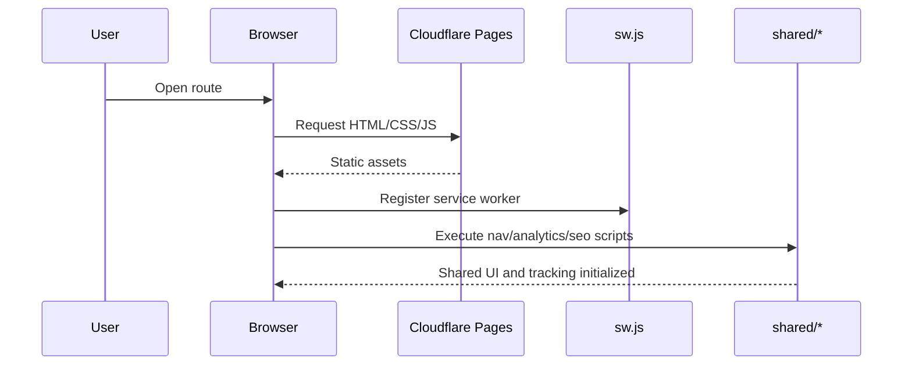
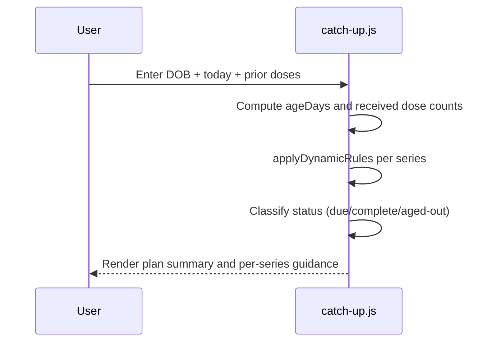
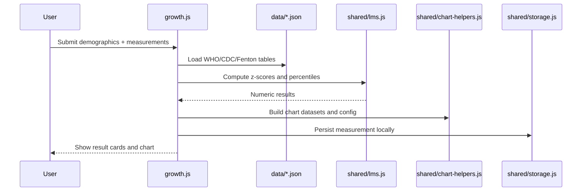
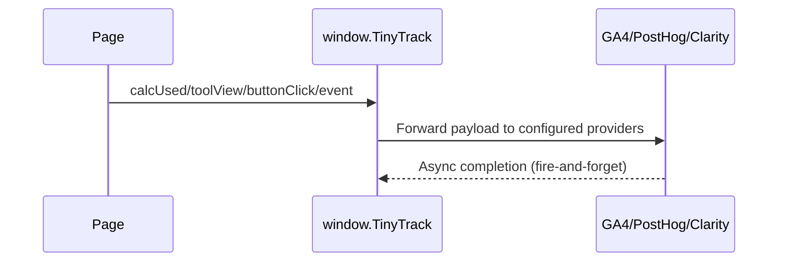

# Codebase Map

> Auto-generated map for TinyHumanMD. Last mapped: 2026-02-17T02:29:27Z.

## System Overview

TinyHumanMD is a static pediatric clinical toolkit deployed on Cloudflare Pages. All calculators run client-side with vanilla JavaScript and local JSON reference files; there is no application backend.

This map uses a deterministic local token estimate (`bytes / 4`) because `tiktoken` is unavailable in this environment.

### Update Delta (vs prior map)

- Repository instructions are now Codex-oriented via `AGENTS.md` (replacing legacy assistant-specific repo metadata).
- `docs/CODEBASE_MAP.md` was fully refreshed with route-runtime matrices, data contract tables, and a stricter QA appendix.
- Inventory baseline is now explicitly scoped to exclude `docs/**` and `package-lock.json` for stable diffs.

## Architecture

```mermaid
graph TB
    U[User Browser] --> CF[Cloudflare Pages]

    subgraph Routes
      HOME[/]
      CU[/catch-up/]
      GR[/growth/]
      BI[/bili/]
      GA[/ga-calc/]
      DO[/dosing/]
      TE[/terms/]
      PR[/privacy/]
    end

    subgraph Shared Runtime
      NAV[shared/nav.js]
      SEO[shared/seo.js]
      AN[shared/analytics.js]
      LMS[shared/lms.js]
      CH[shared/chart-helpers.js]
      ST[shared/storage.js]
      DES[shared/design.css]
    end

    subgraph Clinical Data
      W[data/who-lms.json]
      C[data/cdc-lms.json]
      F[data/fenton-2025-lms.json]
      B[data/bili-thresholds.json]
      D[data/dosing-reference.json]
      A[data/cdsi-antigens.json]
    end

    subgraph Platform
      SW[sw.js]
      IDB[(IndexedDB)]
      CDN[Chart.js CDN]
      EXT[GA4 / PostHog / Clarity / CF]
    end

    HOME --> AN
    HOME --> SEO

    CU --> NAV
    CU --> AN
    CU --> SEO

    GR --> NAV
    GR --> AN
    GR --> SEO
    GR --> LMS
    GR --> CH
    GR --> ST
    GR --> W
    GR --> C
    GR --> F
    GR --> CDN
    GR --> IDB

    BI --> NAV
    BI --> AN
    BI --> SEO
    BI --> CH
    BI --> B
    BI --> CDN

    GA --> NAV
    GA --> AN
    GA --> SEO

    DO --> NAV
    DO --> AN
    DO --> SEO
    DO --> D

    TE --> NAV
    TE --> AN
    TE --> SEO

    PR --> NAV
    PR --> AN
    PR --> SEO

    HOME --> SW
    CU --> SW
    GR --> SW
    BI --> SW
    GA --> SW
    DO --> SW
    TE --> SW
    PR --> SW
    AN --> EXT
    SW --> A
```

## Route Runtime Matrix

| Route | Entry HTML | Primary Page JS | Shared JS chain | Data dependencies | Notes |
|------|------------|-----------------|-----------------|-------------------|------|
| `/` | `index.html` | `app.js` | `shared/analytics-config.js`, `shared/analytics.js`, `shared/seo.js` | None fetched at runtime | Home page keeps its own nav logic inside `app.js` (does not use `shared/nav.js`). |
| `/catch-up/` | `catch-up/index.html` | `catch-up/catch-up.js` | `shared/nav.js`, `shared/analytics-config.js`, `shared/analytics.js`, `shared/seo.js` | In-script vaccine rule table | Catch-up logic is rule-driven and date arithmetic is simplified (dose count, not exact administered dates). |
| `/growth/` | `growth/index.html` | `growth/growth.js` | `shared/lms.js`, `shared/chart-helpers.js`, `shared/storage.js`, `shared/nav.js`, analytics/seo | `data/who-lms.json`, `data/cdc-lms.json`, `data/fenton-2025-lms.json` | Uses Chart.js CDN and writes local measurements to IndexedDB via `Storage`. |
| `/bili/` | `bili/index.html` | `bili/bili.js` | `shared/chart-helpers.js`, `shared/nav.js`, analytics/seo | `data/bili-thresholds.json` | Interpolates threshold curves and renders risk band plus chart. |
| `/ga-calc/` | `ga-calc/index.html` | `ga-calc/ga-calc.js` | `shared/nav.js`, analytics/seo | None | Date-derived GA/LMP/EDD logic, includes clipboard copy helper. |
| `/dosing/` | `dosing/index.html` | `dosing/dosing.js` | `shared/nav.js`, analytics/seo | `data/dosing-reference.json` | Weight conversion + per-formulation dose volume tables. |
| `/terms/` | `terms/index.html` | Inline only | `shared/nav.js`, `shared/analytics.js`, `shared/seo.js` | None | Legal content page. |
| `/privacy/` | `privacy/index.html` | Inline only | `shared/nav.js`, `shared/analytics.js`, `shared/seo.js` | None | Legal content page. |

## Directory Structure

```text
.
├── AGENTS.md                                 # Codex repository rules and high-level orientation
├── index.html / app.js / styles.css          # Main immunization schedule experience
├── catch-up/                                 # Catch-up planner page + rules + styling
├── growth/                                   # Growth percentile calculator and chart UI
├── bili/                                     # Bilirubin risk calculator and chart UI
├── ga-calc/                                  # Gestational age and corrected age calculator
├── dosing/                                   # Pediatric medication dose calculator
├── shared/                                   # Shared nav, analytics, seo, LMS, chart, local storage, shared CSS
├── data/                                     # Clinical reference datasets used by calculators
├── terms/ / privacy/                         # Legal pages
├── scripts/deploy.sh                         # Interactive deploy driver for staging/production
├── sw.js                                     # Service worker cache strategy and offline fallback
├── wrangler.toml / staging-wrangler.toml    # Cloudflare Pages configs
├── _headers / manifest.json / robots.txt     # HTTP caching/security + PWA + crawler config
├── blog54/                                   # Empty directory (currently unused)
└── homepage/                                 # Empty directory (currently unused)
```

## Inventory Snapshot

### Top-Level Module Totals

| Module | File count | Estimated tokens |
|------|------------|------------------|
| `(root)` | 15 | 31,393 |
| `shared` | 8 | 18,253 |
| `catch-up` | 3 | 10,600 |
| `data` | 6 | 10,387 |
| `growth` | 3 | 8,993 |
| `bili` | 3 | 6,495 |
| `ga-calc` | 3 | 5,873 |
| `dosing` | 3 | 5,738 |
| `terms` | 1 | 1,948 |
| `privacy` | 1 | 1,880 |
| `scripts` | 1 | 890 |

### Largest Files

| File | Estimated tokens |
|------|------------------|
| `app.js` | 10,139 |
| `styles.css` | 9,113 |
| `index.html` | 8,286 |
| `shared/analytics.js` | 7,357 |
| `catch-up/catch-up.js` | 5,789 |
| `growth/index.html` | 4,920 |
| `bili/index.html` | 4,181 |
| `shared/design.css` | 3,949 |

## Module Guide

### Home Schedule Module

**Entry points**: `index.html`, `app.js`, `styles.css`.

**Purpose**: Presents vaccine schedule matrix, timeline, expanded card details, and informational sections (adult, pregnancy, travel, mpox).

**Key behaviors**:
- Vaccine schedule data is hardcoded in `app.js` (`VACCINES`, `AGE_COLS`).
- Filtering and chip state are client-only.
- Modal, desktop nav, and mobile nav behavior are implemented inline in `app.js`.

### Catch-Up Module

**Entry points**: `catch-up/index.html`, `catch-up/catch-up.js`, `catch-up/catch-up.css`.

**Purpose**: Generates catch-up guidance from child age and prior dose counts.

**Key behaviors**:
- Rules are encoded in `SERIES` plus `applyDynamicRules`.
- Handles age gates and hard stops (examples: rotavirus start window, HPV >26 routine-start guard, DTaP vs Tdap transition).
- Output buckets: `due`, `complete`, `aged-out`.

### Growth Module

**Entry points**: `growth/index.html`, `growth/growth.js`, `growth/growth.css`.

**Purpose**: Calculates percentiles/Z-scores using WHO/CDC/Fenton datasets and renders percentile curves.

**Key behaviors**:
- Uses shared LMS math (`LMS.calculate`, `LMS.percentileCurve`).
- Uses shared chart factory (`ChartHelpers`).
- Persists measurements locally through `Storage` (IndexedDB).

### Bilirubin Module

**Entry points**: `bili/index.html`, `bili/bili.js`, `bili/bili.css`.

**Purpose**: Evaluates TSB relative to AAP phototherapy and exchange-transfusion thresholds.

**Key behaviors**:
- Loads threshold curves from `data/bili-thresholds.json`.
- Interpolates threshold values by postnatal hour.
- Renders risk-level banner and threshold chart.

### Gestational Age Module

**Entry points**: `ga-calc/index.html`, `ga-calc/ga-calc.js`, `ga-calc/ga-calc.css`.

**Purpose**: Derives GA/LMP/EDD/corrected age values from partial date inputs.

**Key behaviors**:
- Supports bidirectional derivation between LMP and EDD.
- Calculates term classification and corrected age logic for preterm births.
- Includes clipboard export of computed summary.

### Dosing Module

**Entry points**: `dosing/index.html`, `dosing/dosing.js`, `dosing/dosing.css`.

**Purpose**: Computes weight-based medication doses and converts to formulation-specific volume.

**Key behaviors**:
- Converts input weight to kg.
- Applies per-medication max dose capping.
- Calculates mL/tab equivalents per available concentration.

### Shared Runtime Module

**Key files**:

| File | Purpose |
|------|---------|
| `shared/nav.js` | Injects cross-tool nav shell and mobile menu; handles PostHog survey trigger button. |
| `shared/analytics.js` | Analytics bootstrap + custom event API (`window.TinyTrack`). |
| `shared/seo.js` | FAQ accordion + related tools block rendering. |
| `shared/lms.js` | LMS interpolation, z-score, percentile math helpers. |
| `shared/chart-helpers.js` | Chart.js presets and dataset factories. |
| `shared/storage.js` | IndexedDB wrapper for local patient/measurement storage. |

**Public globals emitted**:
- `window.TinyTrack`
- `LMS`
- `ChartHelpers`
- `Storage`

### Data Module

**Data contracts (top-level keys)**:

| File | Top-level keys |
|------|----------------|
| `data/bili-thresholds.json` | `_note`, `_source`, `exchangeTransfusion`, `phototherapy`, `riskFactors` |
| `data/cdc-lms.json` | `_source`, `_unit`, `bmiForAge`, `statureForAge`, `weightForAge` |
| `data/cdsi-antigens.json` | `_note`, `_source`, `_version`, `antigens` |
| `data/dosing-reference.json` | `_disclaimer`, `_source`, `medications` |
| `data/fenton-2025-lms.json` | `_note`, `_source`, `_unit`, `headCircForGA`, `lengthForGA`, `weightForGA` |
| `data/who-lms.json` | `_source`, `_unit`, `headCircForAge`, `lengthForAge`, `weightForAge` |

**Current usage**:
- `data/cdsi-antigens.json` is pre-cached by `sw.js` but not read by calculator logic currently.

### Platform and Deployment Module

**Key files**:
- `sw.js`
- `_headers`
- `manifest.json`
- `scripts/deploy.sh`
- `wrangler.toml`
- `staging-wrangler.toml`

**Notable behavior**:
- `sw.js` uses manual pre-cache list + cache-first fetch strategy.
- `scripts/deploy.sh` swaps `wrangler.toml` for staging deploys and restores afterward.
- `wrangler.toml` and `staging-wrangler.toml` currently share the same `name` value (`tinyhumanmd-staging`).

## Data Flow

### 1) Page Bootstrap Flow



### 2) Catch-Up Planning Flow



### 3) Growth Calculation Flow



### 4) Analytics/Event Flow



## Conventions

- No frontend framework; modules are mostly IIFEs with DOM-side effects.
- Shared cross-page concerns are centralized under `shared/`.
- Clinical calculators prefer local JSON assets and avoid remote data dependencies.
- Service worker registration is duplicated per page as inline script.
- Styling is split between page-local CSS and shared design tokens in `shared/design.css`.

## Gotchas

- `shared/analytics-config.js` is expected by multiple pages but is gitignored; missing file causes fallback to hardcoded defaults in `shared/analytics.js`.
- Vaccine schedule content is duplicated between `app.js` and `catch-up/catch-up.js`, so updates can drift.
- Catch-up input model uses dose count checkboxes (not administration dates), which limits interval validation fidelity.
- `sw.js` cache manifest is manual; new assets must be added deliberately to keep offline behavior consistent.
- `scripts/deploy.sh` temporarily renames `wrangler.toml`; interrupted runs can leave `wrangler.toml.bak` state behind.
- `wrangler.toml` and `staging-wrangler.toml` currently target the same Pages name, increasing accidental-target risk.
- `blog54/` and `homepage/` exist but are empty, which can confuse ownership expectations.

## Navigation Guide

**To update immunization schedule content**:
1. Edit vaccine models in `app.js`.
2. Mirror catch-up rule implications in `catch-up/catch-up.js`.
3. Validate section rendering on `/` and `/catch-up/`.

**To adjust catch-up age/interval logic**:
1. Update `SERIES` and `applyDynamicRules` in `catch-up/catch-up.js`.
2. Verify `aged-out`, `due`, and `complete` outputs with representative ages.

**To modify growth percentile calculations**:
1. Update math in `shared/lms.js` only if algorithm changes.
2. Update data selection/charting logic in `growth/growth.js`.
3. Verify WHO/CDC/Fenton branching and chart-tab behavior.

**To add or revise dosing references**:
1. Edit `data/dosing-reference.json`.
2. Confirm card rendering and capped-dose text in `dosing/dosing.js`.

**To modify cross-page navigation or shared UI shell**:
1. Update `shared/nav.js`.
2. Update shared styles in `shared/design.css`.

**To modify analytics behavior**:
1. Update event surface in `shared/analytics.js` (`window.TinyTrack`).
2. Ensure runtime keys expected by `shared/analytics-config.js` remain compatible.

**To add a new tool page**:
1. Create `<tool>/index.html`, `<tool>/<tool>.js`, `<tool>/<tool>.css`.
2. Add route in `shared/nav.js`.
3. Add service worker assets in `sw.js`.
4. Add sitemap entry in `sitemap.xml`.
5. Link from home/tools section if needed.

## Executor-Critic QA Status

This map is validated in an executor-vs-critic loop with 24 checks (minimum requested: 20). See the validation summary from the current run in the task completion message.
